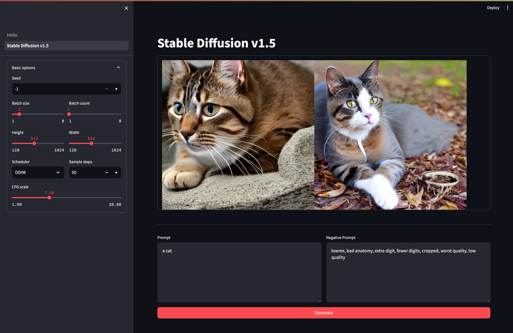

# sd-diffusers-streamlit

A Stable Diffusion WebUI based on [Diffusers](https://huggingface.co/docs/diffusers/index) and [Streamlit](https://streamlit.io/).


## Installation

Clone the repository:

```shell
git clone https://github.com/xyfJASON/sd-diffusers-streamlit.git
cd sd-diffusers-streamlit
```

Create and activate a conda environment:

```shell
conda create -n sd-diffusers-streamlit python=3.11
conda activate sd-diffusers-streamlit
```

Install torch and torchvision:

```shell
pip install torch==2.2.2 torchvision==0.17.2 --index-url https://download.pytorch.org/whl/cu121
```

Install other dependencies:

```shell
pip install -r requirements.txt
```


## Usage

Run the Streamlit app:

```shell
streamlit run Hello.py
```

Then you can visit the Streamlit app in your browser at `http://localhost:8501`.


